# Blog简易博客系统

这是一个简易的博客系统，是这学期JavaWeb的期末项目，相对于常用的博客系统而已，还有很多功能尚未完善，例如没有独立的权限管理模块，点赞，收藏，归档，分类、数据统计等功能（这些没完成的部分等课设的应该会视情况而去完善）。该博客系统实现的主要功能看下面的项目介绍。

# 项目简介

该博客系统前后大概花了十天左右的时间。说实话，写前端真的是一件令人头大的事，十天时间里面，有七天左右在写界面。而且在实现具体功能的时候，也总是在前端部分出现各种莫名奇妙的玄学Bug。


该博客系统主要有以下几个功能：

1. 用户的登录与注册。
2. 发表编辑修改博客。
3. 查阅博客详情以及按关键字对博客标题进行模糊搜索。
4. 对博客的评论，评论回复时的邮件提醒。
5. 在留言板进行留言，或者删除留言，留言回复时的邮件提醒。
6. 个人信息展示以及修改。
7. 文件服务器，用于保存系统上传的图片等资源。
8. 后台管理员管理用户，博客、评论、留言的信息。可以查询所有内容以及进行删除操作。

上述功能除了查阅博客详情，搜索博客以及留言板留言可以在游客状态（未登录状态）下进行访问，其余必须为登陆后的用户才有权限操作。


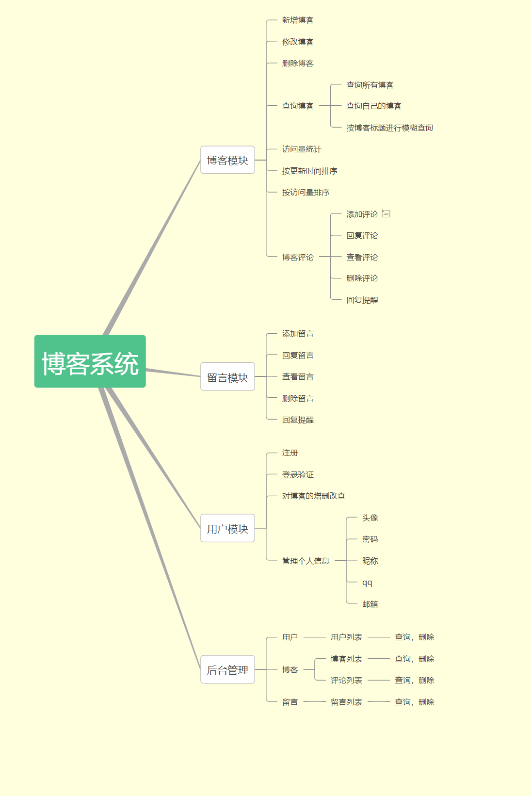

## 项目技术介绍

前端：Thymeleaf模板引擎、Semantic UI框架、Jquery框架以及editormd、simditor、cropper，prism，typo等插件

后端：Springboot、持久层采用Mybatis-Plus

数据库：MySQL

项目管理工具：Maven


1. 使用Thymeleaf模板引擎对前端界面进行渲染，个人觉得使用JSP不利于前端的编写，因为JSP文件浏览器并不能对其渲染，而必须依托于服务器才行，导致有时候改了某些效果之后不方便立即查看。而thymleaf的话对网页整体是没有影响的，可以直接用浏览器打开显示。 除此之外使用Semantic UI实现页面的响应式布局。
2. 为了保证数据的完整性，在用户注册、个人信息修改以及博客编辑上，采用了Semantic UI提供的api对表单进行校验。
3. editormd为markdown编辑器插件，用于博客的编写。simditor为富文本编辑器插件用于评论、留言的编写。cropper图片剪切插件，用于剪切图片。prism、typo用于博客详情页面的布局。
4. 后端使用SpringBoot自动装配web等运行环境，省去ssm框架一堆麻烦的配置。使用Mybatis-Plus 替代mybatis，MP实现了对单表的增删改查，分页等操作。在整个项目中，基本不需要写SQL，只要把查询条件封装好就行。
5. 用AOP技术把URL请求的参数、方法名以及结果记录到日志中。
6. 在编辑博客以及修改个人头像的时候，难免需要上传图片信息，所以基于Springboot框架单独实现了一个文件服务器，用于存储图片等资源。该服务器提供了三个API，分别用于editormd、simditor以及本系统的图片上传业务。具体实现可以参考上一篇博客[【SpringBoot】如何优雅的实现跨服务器上传文件](https://blog.csdn.net/qq_43058685/article/details/105702007)。
7. 还有一些java的api插件，用于发送邮件等。


# 数据库设计


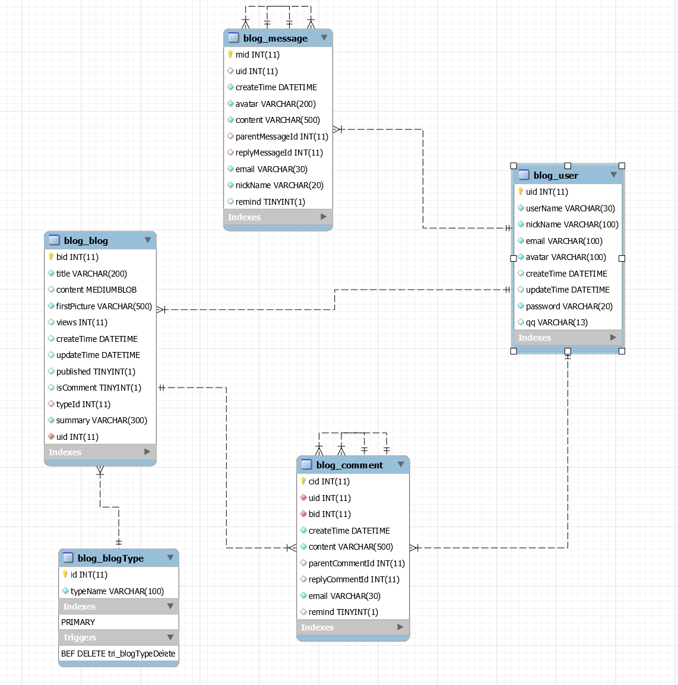


留言模块的回复用如上图所示的层级关系展示，一条父留言为根节点，之后回复该留言，或者对该留言中的回复进行回复的留言都以兄弟节点的关系形式表示。所以上图的三条留言中，jiang留言（cid=1）的parentMessageId和replyMessageId都为null，因为它是作为根节点的。Jxj留言（cid=2）的parentMessageId和replyMessageId都为1，因为它回复的留言以及根留言都是（cid=1）这条留言。最后jiang4869的这条回复的parentMessageId和replyMessageId分别为（1，2），因为它回复的是jxj的留言，所以replyMessageId为2，它所在的根节点jiang的留言cid=1，所以parentMessageId=1。


# 项目效果展示

**用户登录界面**

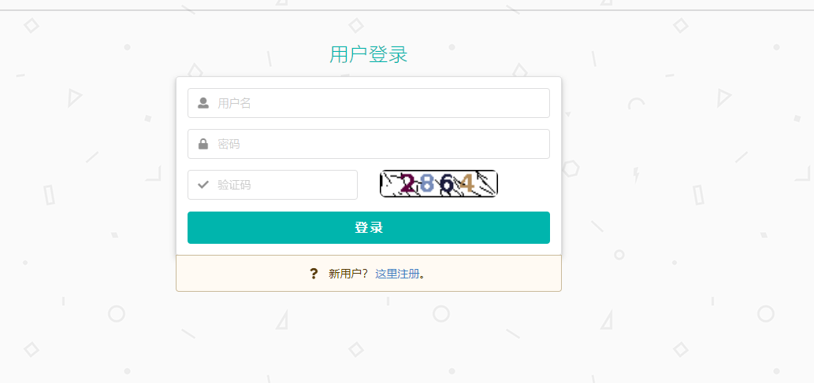

**用户注册界面**


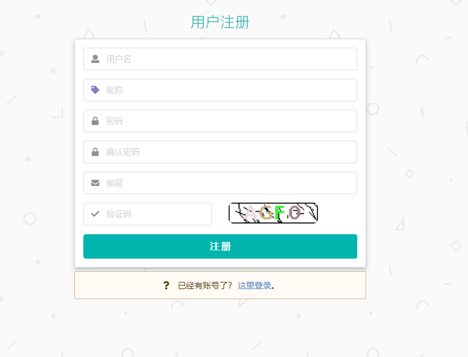


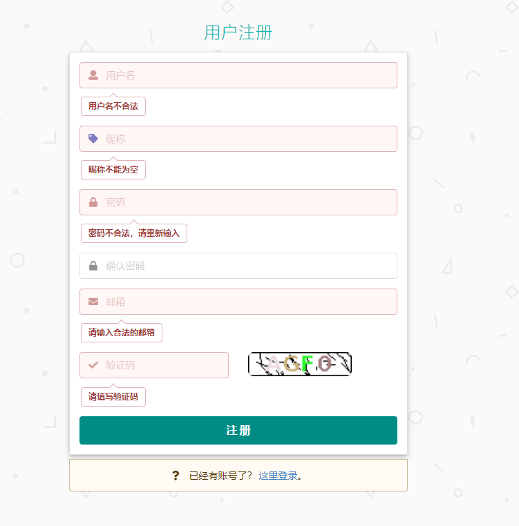

**登录成功后的首页**


**博客列表**


**博客编辑界面**

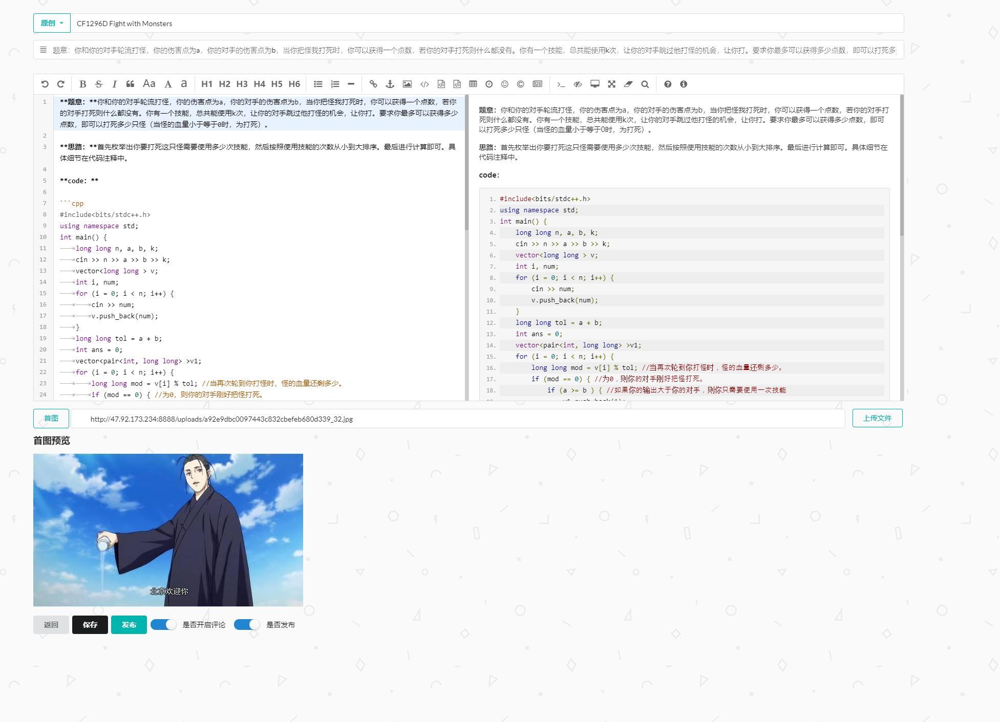

**博客详情界面**

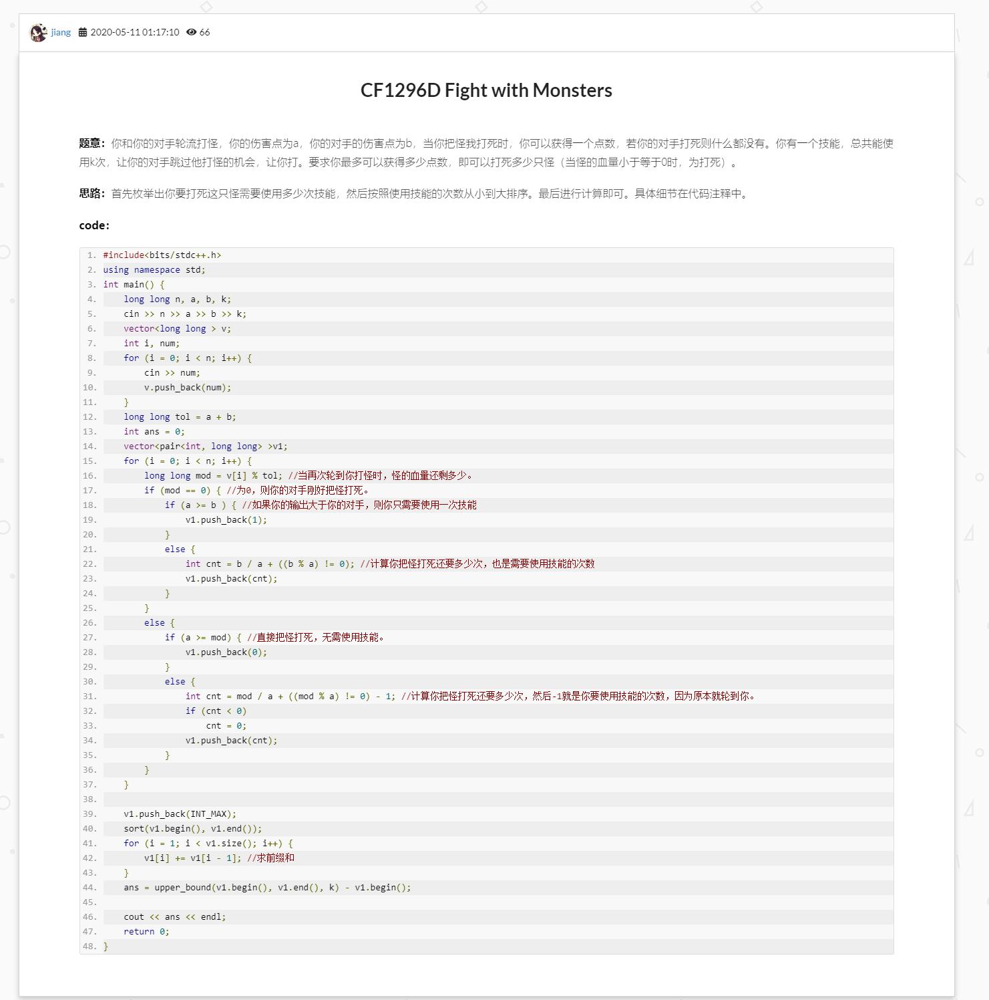


**个人信息界面**


**个人博客管理界面**

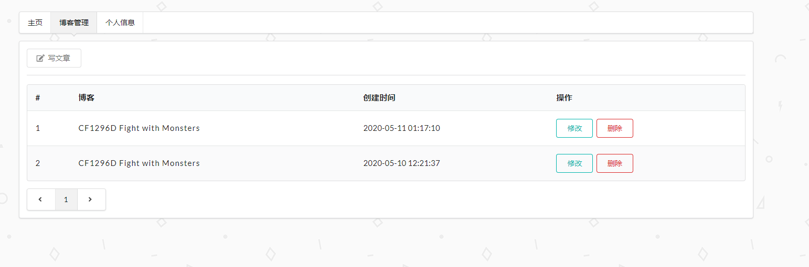


**个人信息修改界面**


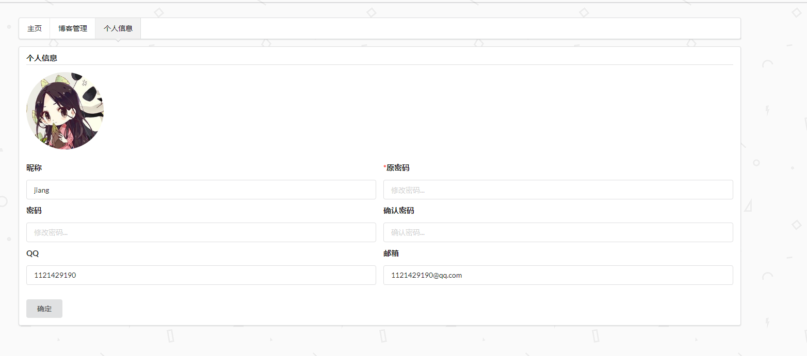


**头像上传界面**


**留言板**


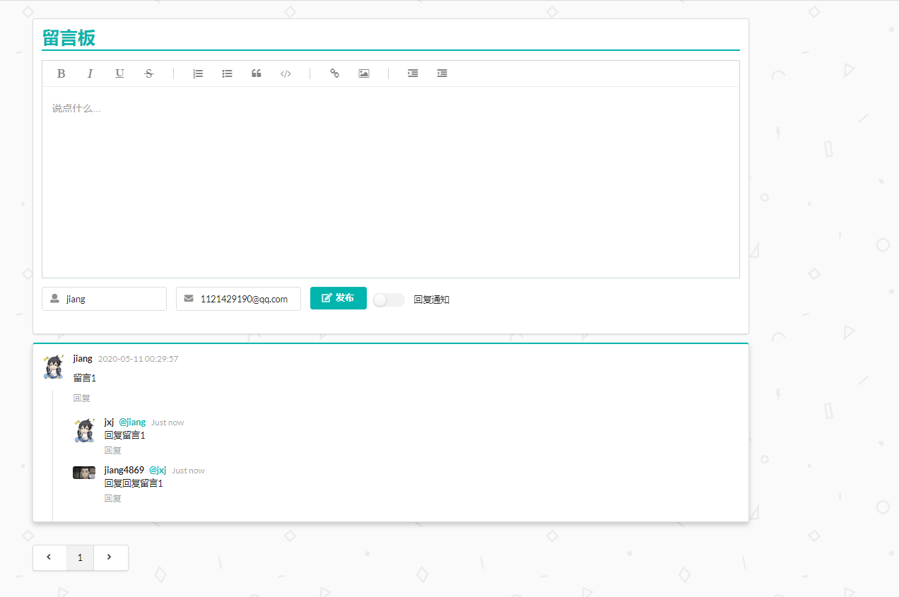


**后台管理界面**

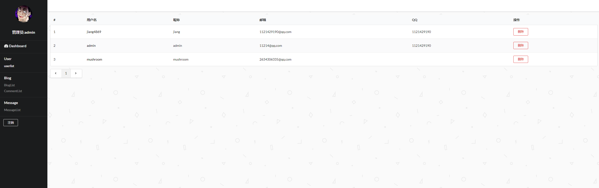


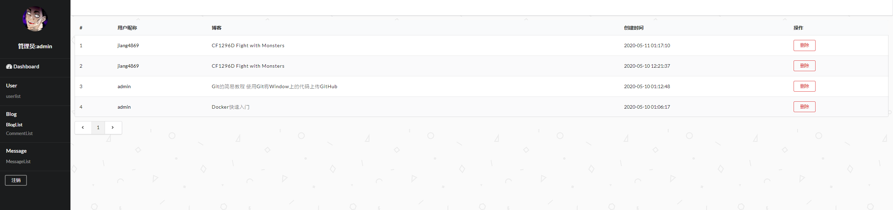


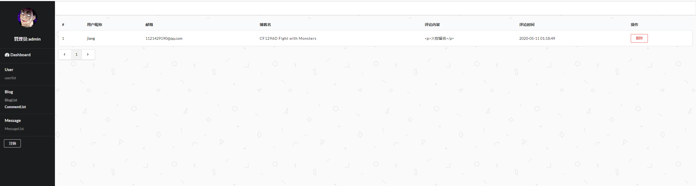


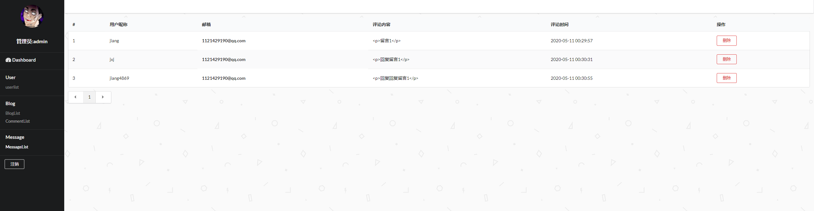


# 项目搭建

pom文件的坐标

```xml
<?xml version="1.0" encoding="UTF-8"?>
<project xmlns="http://maven.apache.org/POM/4.0.0" xmlns:xsi="http://www.w3.org/2001/XMLSchema-instance"
         xsi:schemaLocation="http://maven.apache.org/POM/4.0.0 https://maven.apache.org/xsd/maven-4.0.0.xsd">
    <modelVersion>4.0.0</modelVersion>
    <parent>
        <groupId>org.springframework.boot</groupId>
        <artifactId>spring-boot-starter-parent</artifactId>
        <version>2.2.6.RELEASE</version>
        <relativePath/> <!-- lookup parent from repository -->
    </parent>
    <groupId>cn.jxj4869</groupId>
    <artifactId>blog</artifactId>
    <version>0.0.1-SNAPSHOT</version>
    <name>blog</name>
    <description>project for blog</description>

    <properties>
        <java.version>1.8</java.version>
        <thymeleaf.version>3.0.11.RELEASE</thymeleaf.version>
        <thymeleaf-layout-dialect.version>2.1.1</thymeleaf-layout-dialect.version>
    </properties>

    <dependencies>

        <!--aop-->
        <dependency>
            <groupId>org.springframework.boot</groupId>
            <artifactId>spring-boot-starter-aop</artifactId>
        </dependency>

        <dependency>
            <groupId>org.springframework.boot</groupId>
            <artifactId>spring-boot-starter-web</artifactId>
        </dependency>

        <!--模板引擎-->
        <dependency>
            <groupId>org.springframework.boot</groupId>
            <artifactId>spring-boot-starter-thymeleaf</artifactId>
        </dependency>

        <!--JDBC-->

        <dependency>
            <groupId>org.springframework.boot</groupId>
            <artifactId>spring-boot-starter-jdbc</artifactId>
        </dependency>
        <!--jdbc驱动-->
        <dependency>
            <groupId>mysql</groupId>
            <artifactId>mysql-connector-java</artifactId>
            <scope>runtime</scope>
        </dependency>

        <!--mybatis-plus-->
        <dependency>
            <groupId>com.baomidou</groupId>
            <artifactId>mybatis-plus-boot-starter</artifactId>
            <version>3.3.1.tmp</version>
        </dependency>
        <!--代码生成器插件-->
        <dependency>
            <groupId>com.baomidou</groupId>
            <artifactId>mybatis-plus-generator</artifactId>
            <version>3.3.1</version>
        </dependency>

        <dependency>
            <groupId>org.freemarker</groupId>
            <artifactId>freemarker</artifactId>
            <version>2.3.30</version>
        </dependency>

        <!--数据连接池-->
        <dependency>
            <groupId>com.alibaba</groupId>
            <artifactId>druid</artifactId>
            <version>1.1.8</version>
        </dependency>

        <!--邮件-->
        <dependency>
            <groupId>org.springframework.boot</groupId>
            <artifactId>spring-boot-starter-mail</artifactId>
        </dependency>


<!--        &lt;!&ndash;shiro&ndash;&gt;-->
<!--        <dependency>-->
<!--            <groupId>org.apache.shiro</groupId>-->
<!--            <artifactId>shiro-spring</artifactId>-->
<!--            <version>1.4.2</version>-->
<!--        </dependency>-->


        <!--开发工具-->
        <dependency>
            <groupId>org.springframework.boot</groupId>
            <artifactId>spring-boot-devtools</artifactId>
            <scope>runtime</scope>
            <optional>true</optional>
        </dependency>

        <dependency>
            <groupId>org.projectlombok</groupId>
            <artifactId>lombok</artifactId>
            <optional>true</optional>
        </dependency>

        <!--日志-->
        <dependency>
            <groupId>log4j</groupId>
            <artifactId>log4j</artifactId>
            <version>1.2.17</version>
        </dependency>


        <!--文件上传插件-->
        <dependency>
            <groupId>com.sun.jersey</groupId>
            <artifactId>jersey-core</artifactId>
            <version>1.18.1</version>
        </dependency>
        <dependency>
            <groupId>com.sun.jersey</groupId>
            <artifactId>jersey-client</artifactId>
            <version>1.18.1</version>
        </dependency>

        <!--Http工具-->
        <dependency>
            <groupId>org.apache.httpcomponents</groupId>
            <artifactId>httpclient</artifactId>
            <version>4.3.6</version>
        </dependency>
        <dependency>
            <groupId>org.apache.httpcomponents</groupId>
            <artifactId>httpmime</artifactId>
            <version>4.5</version>
        </dependency>
        <dependency>
            <groupId>org.apache.httpcomponents</groupId>
            <artifactId>httpcore</artifactId>
            <version>4.4.1</version>
        </dependency>


        <!--markdown转HTML-->

        <dependency>
            <groupId>com.atlassian.commonmark</groupId>
            <artifactId>commonmark</artifactId>
            <version>0.10.0</version>
        </dependency>
        <dependency>
            <groupId>com.atlassian.commonmark</groupId>
            <artifactId>commonmark-ext-heading-anchor</artifactId>
            <version>0.10.0</version>
        </dependency>
        <dependency>
            <groupId>com.atlassian.commonmark</groupId>
            <artifactId>commonmark-ext-gfm-tables</artifactId>
            <version>0.10.0</version>
        </dependency>

        <!--测试工具-->
        <dependency>
            <groupId>org.springframework.boot</groupId>
            <artifactId>spring-boot-starter-test</artifactId>
            <scope>test</scope>
            <exclusions>
                <exclusion>
                    <groupId>org.junit.vintage</groupId>
                    <artifactId>junit-vintage-engine</artifactId>
                </exclusion>
            </exclusions>
        </dependency>
    </dependencies>

    <build>
        <plugins>
            <plugin>
                <groupId>org.springframework.boot</groupId>
                <artifactId>spring-boot-maven-plugin</artifactId>
            </plugin>
        </plugins>
    </build>

</project>

```


**配置文件**

```yaml
spring:
  datasource:
    username: root
    password: root
    url: jdbc:mysql://localhost4:3306/blog?serverTimezone=UTC&characterEncoding=utf8
    driver-class-name: com.mysql.cj.jdbc.Driver
    type: com.alibaba.druid.pool.DruidDataSource
    initialSize: 5
    minIdle: 5
    maxActive: 20
    maxWait: 60000
    timeBetweenEvictionRunsMillis: 60000
    minEvictableIdleTimeMillis: 300000
    validationQuery: SELECT 1 FROM DUAL
    testWhileIdle: true
    testOnBorrow: false
    testOnReturn: false
    poolPreparedStatements: true
    initialization-mode: always
    #    schema:
    #      - classpath:sql/user.sql
    #      - classpath:sql/employee.sql
    #   配置监控统计拦截的filters，去掉后监控界面sql无法统计，'wall'用于防火墙
    filters: stat,wall,log4j
    maxPoolPreparedStatementPerConnectionSize: 20
    useGlobalDataSourceStat: true
    connectionProperties: druid.stat.mergeSql=true;druid.stat.slowSqlMillis=500


```


```properties

#跨服务器上传文件的地址，与文件服务器的接口对应
file.upload.path.editormd=http://localhost:8888/fileupload/md/
file.upload.path.simditor=http://localhost:8888/fileupload/simditor/
file.upload.path=http://localhost:8888/fileupload/


#文件上传相关参数
spring.servlet.multipart.enabled=true
spring.servlet.multipart.max-file-size=300MB
spring.servlet.multipart.max-request-size=300MB


#邮件发送的配置
spring.mail.username=youremail
spring.mail.password=password
spring.mail.host=smtp.qq.com

#配置465端口，保证在服务器上正常使用
spring.mail.properties.mail.smtp.socketFactory.port=465
spring.mail.default-encoding=UTF-8
spring.mail.properties.mail.smtp.auth=true
spring.mail.properties.mail.smtp.starttls.enable=true
spring.mail.properties.mail.smtp.starttls.required=true
spring.mail.port=465
spring.mail.properties.mail.smtp.socketFactory.class = javax.net.ssl.SSLSocketFactory
spring.mail.properties.mail.smtp.socketFactory.fallback = false


#禁用thymeleaf缓存
spring.thymeleaf.cache=false


#开启对隐藏域方法的支持
spring.mvc.hiddenmethod.filter.enabled=true

```


**配置类**

DruidConfig.java

```java
package cn.jxj4869.blog.config;

import com.alibaba.druid.pool.DruidDataSource;
import org.springframework.boot.context.properties.ConfigurationProperties;
import org.springframework.context.annotation.Bean;
import org.springframework.context.annotation.Configuration;

@Configuration
public class DruidConfig {

    @ConfigurationProperties("spring.datasource")

    @Bean
    public DruidDataSource druidDataSource() {
        return new DruidDataSource();
    }
}

```

MybatisPlusConfig.java

```java
package cn.jxj4869.blog.config;

import com.baomidou.mybatisplus.extension.plugins.PaginationInterceptor;
import org.springframework.context.annotation.Bean;
import org.springframework.context.annotation.Configuration;

@Configuration
public class MybatisPlusConfig {
    @Bean
    public PaginationInterceptor paginationInterceptor(){
        return new PaginationInterceptor();
    }
}
```


**log4j配置文件**

```properties
# Set root category priority to INFO and its only appender to CONSOLE.
#log4j.rootCategory=INFO, CONSOLE            debug   info   warn error fatal
log4j.rootCategory=debug, CONSOLE, LOGFILE

# Set the enterprise logger category to FATAL and its only appender to CONSOLE.
log4j.logger.org.apache.axis.enterprise=FATAL, CONSOLE

# CONSOLE is set to be a ConsoleAppender using a PatternLayout.
log4j.appender.CONSOLE=org.apache.log4j.ConsoleAppender
log4j.appender.CONSOLE.layout=org.apache.log4j.PatternLayout
log4j.appender.CONSOLE.layout.ConversionPattern=%d{ISO8601} %-6r [%15.15t] %-5p %30.30c %x - %m\n

# LOGFILE is set to be a File appender using a PatternLayout.
log4j.appender.LOGFILE=org.apache.log4j.FileAppender
log4j.appender.LOGFILE.File=log/log.log
log4j.appender.LOGFILE.Append=true
log4j.appender.LOGFILE.layout=org.apache.log4j.PatternLayout
log4j.appender.LOGFILE.layout.ConversionPattern=%d{ISO8601} %-6r [%15.15t] %-5p %30.30c %x - %m\n
```


**SQL脚本**

```sql
create database blog;
use blog;


create table `blog_user`
(
    `uid`        int           not null primary key auto_increment,
    `userName`   varchar(30)   not null unique,
    `nickName`   nvarchar(100) not null,
    `password` varchar(20) not null,
    `email`      nvarchar(100) unique not null,
    `avatar`     varchar(100)  not null,
    `qq`         varchar(13) default null,
    `createTime` datetime default now(),
    `updateTime` datetime default now()

) charset = utf8;


create table `blog_message`
(
    `mid`             int           not null primary key auto_increment,
    `uid`             int           default null,
    `createTime`      datetime      not null,
    `content`         nvarchar(500) not null,
    `parentMessageId` int  default null,
    `replyMessageId`  int  default null,
    `email`           varchar(30)   not null,
    `userName`        nvarchar(20)  not null,
    `remind`          bool default false,
    constraint foreign key (`uid`) references `blog_user` (`uid`) ON DELETE CASCADE ON UPDATE RESTRICT,
    constraint foreign key (`parentMessageId`) references `blog_message` (`mid`) ON DELETE CASCADE ON UPDATE RESTRICT,
    constraint foreign key (`replyMessageId`) references `blog_message` (`mid`) ON DELETE CASCADE ON UPDATE RESTRICT
) charset = utf8;

create table `blog_blogType`
(
    `id`       int           not null primary key auto_increment,
    `typeName` nvarchar(100) not null
) charset = utf8;


create table `blog_blog`
(

    `bid`          int           not null primary key auto_increment,
    `uid` int not null,
    `title`        nvarchar(200) not null,
    `content`      mediumblob default null,
    `summary`      nvarchar(300) not null,
    `firstPicture` varchar(500)  not null,
    `views`        int        default 0,
    `createTime`   datetime   default now(),
    `updateTime`   datetime   default now(),
    `published`    bool       default true,
    `isComment`    bool       default true,
    `typeId`       int        default null,
    constraint foreign key (`typeId`) references `blog_blogType` (`id`),
    constraint foreign key (`uid`) references `blog_user` (`uid`),
) charset = utf8;


create table `blog_comment`
(
    `cid`             int           not null primary key auto_increment,
    `uid`             int           not null,
    `bid`             int           not null,
    `createTime`      datetime      not null,
    `content`         nvarchar(500) not null,
    `parentCommentId` int  default null,
    `replyCommentId`  int  default null,
    `email`           varchar(30)   not null,
    `remind`          bool default false,
    constraint foreign key (`uid`) references `blog_user` (`uid`) ON DELETE CASCADE ON UPDATE RESTRICT,
    constraint foreign key (`parentCommentId`) references `blog_comment` (`cid`) ON DELETE CASCADE ON UPDATE RESTRICT,
    constraint foreign key (`replyCommentId`) references `blog_comment` (`cid`) ON DELETE CASCADE ON UPDATE RESTRICT,
    constraint foreign key (`bid`) references `blog_blog` (`bid`) ON DELETE CASCADE ON UPDATE RESTRICT

) charset = utf8;

create trigger tri_blogTypeDelete
    before delete
    on `blog_blogType`
    for each row
begin
    declare id int;
    select bt.id into id from blog_blogType bt where bt.id = old.id;
    update `blog_blog` set `typeid`=null where `blog_blog`.typeId = id;
end;

```


**前端插件**

均采用最新版本

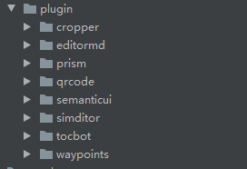


# 文件服务器

部署在Linux系统下。


pom坐标

```xml
<?xml version="1.0" encoding="UTF-8"?>
<project xmlns="http://maven.apache.org/POM/4.0.0" xmlns:xsi="http://www.w3.org/2001/XMLSchema-instance"
         xsi:schemaLocation="http://maven.apache.org/POM/4.0.0 https://maven.apache.org/xsd/maven-4.0.0.xsd">
    <modelVersion>4.0.0</modelVersion>
    <parent>
        <groupId>org.springframework.boot</groupId>
        <artifactId>spring-boot-starter-parent</artifactId>
        <version>2.2.6.RELEASE</version>
        <relativePath/> <!-- lookup parent from repository -->
    </parent>
    <groupId>cn.jxj4869</groupId>
    <artifactId>fileuploadserver1</artifactId>
    <version>0.0.1-SNAPSHOT</version>
    <name>fileuploadserver1</name>
    <description>Demo project for Spring Boot</description>

    <properties>
        <java.version>1.8</java.version>
    </properties>

    <dependencies>
        <dependency>
            <groupId>org.springframework.boot</groupId>
            <artifactId>spring-boot-starter-web</artifactId>
        </dependency>

        <dependency>
            <groupId>org.springframework.boot</groupId>
            <artifactId>spring-boot-starter-test</artifactId>
            <scope>test</scope>
            <exclusions>
                <exclusion>
                    <groupId>org.junit.vintage</groupId>
                    <artifactId>junit-vintage-engine</artifactId>
                </exclusion>
            </exclusions>
        </dependency>
    </dependencies>

    <build>
        <plugins>
            <plugin>
                <groupId>org.springframework.boot</groupId>
                <artifactId>spring-boot-maven-plugin</artifactId>
            </plugin>
        </plugins>
    </build>

</project>
```


配置文件

```properties
# 文件上传位置  这里是路径是相对于项目而言，可以根据实际情况更改
file.upload.save-path=/root/blog/upload/

#文件访问路径
file.upload.url=/uploads/**

file.save-path=./

server.port=8888


server.tomcat.basedir=/root/blog/upload

#文件大小设置
spring.servlet.multipart.enabled=true
spring.servlet.multipart.max-file-size=30MB
spring.servlet.multipart.max-request-size=100MB

#用于返回结果的参数
server.localhost=http://localhost:8888
```


**资源映射代码**

```java
package cn.jxj4869.fileuploadserver1.config;

import org.springframework.beans.factory.annotation.Value;
import org.springframework.cglib.core.WeakCacheKey;
import org.springframework.context.annotation.Configuration;
import org.springframework.web.servlet.config.annotation.ResourceHandlerRegistry;
import org.springframework.web.servlet.config.annotation.WebMvcConfigurer;

@Configuration
public class MySpringMvcConfig implements WebMvcConfigurer {

    @Value("${file.upload.save-path}")
    private String savePath;
    @Value("${file.upload.url}")
    private String url;
    @Override
    public void addResourceHandlers(ResourceHandlerRegistry registry) {
        registry.addResourceHandler(url).addResourceLocations("file:"+savePath);
    }
}

```


**FileController**


```java
package cn.jxj4869.fileuploadserver1.controller;

import cn.jxj4869.fileuploadserver1.domain.Info;
import org.springframework.beans.factory.annotation.Value;
import org.springframework.stereotype.Controller;
import org.springframework.util.ResourceUtils;
import org.springframework.web.bind.annotation.PostMapping;
import org.springframework.web.bind.annotation.RequestMapping;
import org.springframework.web.bind.annotation.RequestParam;
import org.springframework.web.bind.annotation.ResponseBody;
import org.springframework.web.multipart.MultipartFile;

import javax.servlet.http.HttpServletRequest;
import java.io.File;
import java.io.IOException;

import java.util.*;

@Controller
public class FileController {

    @Value("${file.upload.save-path}")
    private String savePath;

    @Value("${server.localhost}")
    private String localhost;


    @RequestMapping("/fileupload")
    @ResponseBody
    private Info fileupload(HttpServletRequest request, @RequestParam("upload") MultipartFile[] uploads) throws IOException {
        System.out.println("文件上传");

        String path="/root/blog/upload";


        File file = new File(path);
        file.setWritable(true,false);
        if (!file.exists()) {
            file.mkdir();
        }

        List<String> list=new LinkedList<>();
        String filepath = localhost + request.getContextPath() + "/uploads/";
        for (MultipartFile upload : uploads) {
            String filename = upload.getOriginalFilename();

            String uuid = UUID.randomUUID().toString().replace("-", "");
            filename = uuid + "_" + filename;

            upload.transferTo(new File(path, filename));

            list.add( filepath + filename);
        }
        System.out.println("aa");
        Info info = new Info();
        info.put("success", 1);
        info.put("msg", "success");
        info.put("url", list.toArray());
        System.out.println(info.toString());
        return info;

    }


    @RequestMapping("/fileupload/md")
    @ResponseBody
    private Info fileuploadMd(HttpServletRequest request, @RequestParam("upload") MultipartFile[] uploads) throws IOException {
        System.out.println("文件上传");

        String path="/root/blog/upload";


        File file = new File(path);
        file.setWritable(true,false);
        if (!file.exists()) {
            file.mkdir();
        }
        String filepath = localhost + request.getContextPath() + "/uploads/";
        for (MultipartFile upload : uploads) {
            String filename = upload.getOriginalFilename();

            String uuid = UUID.randomUUID().toString().replace("-", "");
            filename = uuid + "_" + filename;

            upload.transferTo(new File(path, filename));
            filepath = filepath + filename;
        }
        System.out.println("aa");
        Info info = new Info();
        info.put("success", 1);
        info.put("msg", "success");
        info.put("url", filepath);
        System.out.println(info.toString());
        return info;
    }

    @RequestMapping("/fileupload/simditor")
    @ResponseBody
    private Info simditor(HttpServletRequest request, @RequestParam("upload") MultipartFile[] uploads) throws IOException {
        System.out.println("文件上传");

        String path="/root/blog/upload";


        File file = new File(path);
        file.setWritable(true,false);
        if (!file.exists()) {
            file.mkdir();
        }
        List<String> list=new LinkedList<>();
        String filepath = localhost + request.getContextPath() + "/uploads/";
        for (MultipartFile upload : uploads) {
            String filename = upload.getOriginalFilename();

            String uuid = UUID.randomUUID().toString().replace("-", "");
            filename = uuid + "_" + filename;

            upload.transferTo(new File(path, filename));
           list.add( filepath + filename);
        }
        System.out.println("aa");
        Info info = new Info();
        info.put("success", true);
        info.put("msg", "success");
        info.put("file_path", list.toArray());
        System.out.println(info.toString());
        return info;

    }

}
```


# 项目运行

在运行之前，需要修改jar包中配置文件的一些信息，或者可以在外部编写好配置文件，运行时，使用指定的配置文件也行。


修改`blog-0.0.1-SNAPSHOT`jar包中如下配置。

application.properties

```properties
#邮件发送的配置
spring.mail.username=youremail
spring.mail.password=password
spring.mail.host=smtp.qq.com
```


application.yml

填写对应的数据库地址，然后按照blog.sql文件中的脚本，或者上面提供的脚本创建好数据库。

```yaml
spring:
  datasource:
    username: root
    password: root
    url: jdbc:mysql://localhost4:3306/blog?serverTimezone=UTC&characterEncoding=utf8
```


对了，还要准备好文件服务器，代码在上面已经提供。也有已经打包好的jar包，jar中的配置文件里面

下面这段配置可以改成要返回图片的地址信息。

```properties
server.localhost=http://localhost:8888
```

